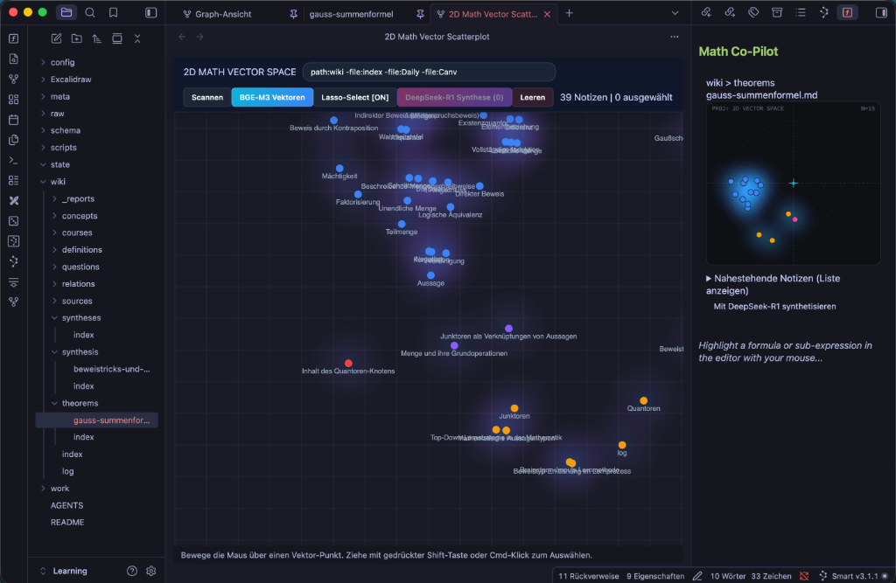

# MemVector Knowledge Engine

A local-first, privacy-focused **2D Vector Space Visualizer, Graph Engine & AI Co-Pilot** for Obsidian.

Powered by **Qdrant Vector DB**, **Memgraph Graph DB**, and **OpenAI-compatible LLMs (Ollama, Anthropic Claude, DeepSeek, OpenAI, OpenRouter)**.

---

## 📚 Documentation

Detailed documentation is available in the [`docs/`](docs/) directory:

- [**System Architecture (`docs/ARCHITECTURE.md`)**](docs/ARCHITECTURE.md): Component map, 2D vector reduction, mini-radar renderer, and LLM integrations.
- [**Configuration & Customization Guide (`docs/CONFIGURATION.md`)**](docs/CONFIGURATION.md): Complete settings reference, LLM provider setup, **Knowledge Domain (`knowledgeDomain`) customization**, and vault exclusions.
- [**User Guide (`docs/USER_GUIDE.md`)**](docs/USER_GUIDE.md): Canvas interaction controls, gesture reference, right glassmorphic panel, mini-radar sidebar, and AI synthesis workflow.

---

## Key Features

- **2D MemVector Graph View:** High-performance HTML5 Canvas with additive density field glow (heatmap layer), real-time query filtering, and smooth trackpad pan/zoom.
- **Selection-Based AI Synthesis:** Lasso select or Cmd-click target nodes in the 2D plot to trigger AI knowledge synthesis using any configured LLM (Ollama, Anthropic Claude, OpenAI, DeepSeek, OpenRouter).
- **Active Note Mini-Radar (Sidebar):** Renders a relative 2D cutout view centered on your active note with polar distance rings and nearest-neighbor navigation.
- **Knowledge Domain Adaptability:** Switch between **Universal Notebook** (PKM, code, general research) and **Mathematics** (boosts LaTeX formula similarity).
- **Multi-Language Support (i18n):** Full UI and settings translation in German and English.
- **External DB Connectors:** Optional Qdrant vector database and Memgraph Cypher graph database sync.

---

## Installation & Setup

1. Copy `main.js` and `manifest.json` to `<your-vault>/.obsidian/plugins/obsidian-memvector-knowledge-engine/`.
2. Enable **MemVector Knowledge Engine** in **Obsidian Settings** -> **Community Plugins**.
3. Configure your preferred LLM Provider in Plugin Settings.

---

## License

Distributed under the [MIT License](LICENSE).
