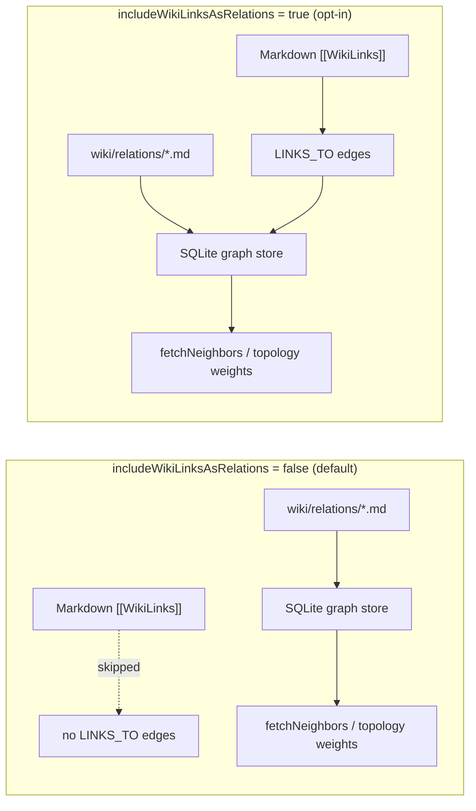

# 0001 — WikiLink Relation Extraction Is Opt-In

Status: Accepted

## Context

MemVector's core architecture centers on high-dimensional vector embeddings
and explicit, typed relations (`wiki/relations/*` created via the Relation
Builder). Until Issue #100, `extractVaultGraph` parsed every standard Obsidian
`[[WikiLink]]` and wrote it as a `LINKS_TO` edge into the SQLite graph store.
Those untyped edges directly fed GraphRAG multi-hop retrieval
(`fetchNeighbors`) and the 2D force-layout topology weights
(`graphTopologyWeights.ts`), so raw, untyped wiki link structure had the same
standing as intentional domain relationships.

That diluted the pure MemVector paradigm: semantic vectors plus deliberate,
typed relations. WikiLinks are often incidental (navigation, structure notes),
not statements about how concepts relate.

## Decision

WikiLink relation extraction is disabled by default and strictly opt-in via the
`includeWikiLinksAsRelations` setting (default `false`).

When the setting is off:

- `extractVaultGraph` / `syncVaultGraph` skip `LINKS_TO` edge generation from
  Markdown WikiLinks; the SQLite graph store indexes only explicit typed
  relations (`REQUIRES`, `SUPPORTS`, `EXTENDS`, …).
- GraphRAG multi-hop synthesis (`fetchNeighbors`) therefore traverses only
  explicit typed relations and vector centroids.
- 2D force-layout topology weights (`graphTopologyWeights.ts`) omit WikiLink
  attraction edges.

When the setting is on, standard Obsidian WikiLinks are treated as `LINKS_TO`
relationships again. The setting takes effect on the next full vault re-index
(`syncVaultGraph` reconciles the store and removes stale `LINKS_TO` edges).

## Consequences

- GraphRAG synthesis and the 2D knowledge graph focus on semantic embeddings
  and explicit, typed relationships by default.
- Users who want the classic wiki-structure graph re-enable the toggle and
  re-index the vault; the change is reversible and data is not lost.
- Visual canvas edge rendering (WikiLink lines on the scatter view) is
  unaffected - that is a separate display concern.
- Documentation must keep stating that WikiLink graph relations are opt-in so
  the default behavior is never advertised as always-on.
